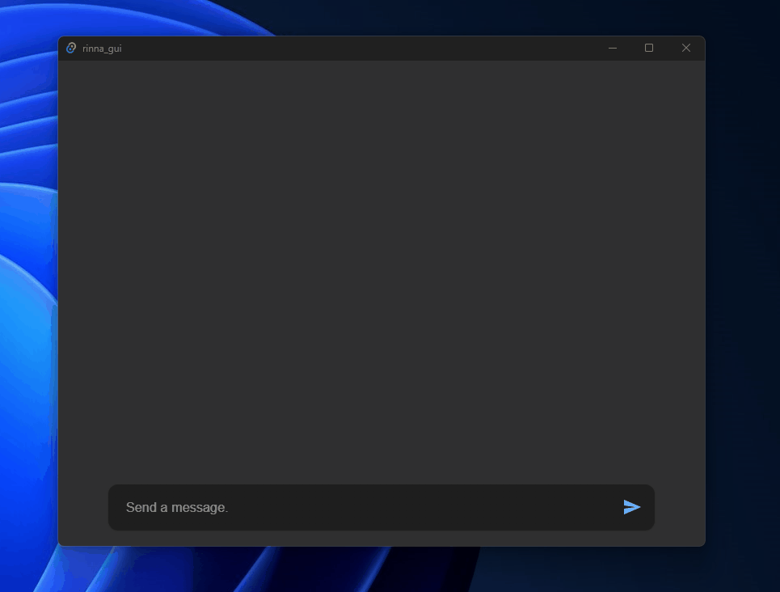

# Rinna GPT

[Rinna社](https://rinna.co.jp/)が提供してくださっている[rinna/japanese-gpt-neox-3.6b-instruction-sft](https://huggingface.co/rinna/japanese-gpt-neox-3.6b-instruction-sft)をローカルでPythonで実行するプログラムを、PyInstallerで実行ファイルとし、Tauriでデスクトップアプリ化したものです。

- リリースページ: https://github.com/anotherhollow1125/rinna_gpt/releases
- インストーラ: https://github.com/anotherhollow1125/rinna_gpt/releases/download/v0.0.5/rinna_gui_0.0.5_x64_ja-JP.msi

## 想定環境

環境はWindows10/11のみになります。

またCPUで演算するため、大容量メモリ(少なくとも32GB)と、高性能なCPUを積んだパソコンでの実行が望ましいです。

なお、Rinna言語モデル自体が7GBほどの容量を持つためCドライブにその分の余裕を持たせてください。

## 使い方

インストール後、起動するとプロンプト部分に"Wait for Rinna..."と表示されています。これが"Send a message."になったらRinna GPTにメッセージを送れるようになります。

- 初回は言語モデルをダウンロードするため、起動に時間がかかります。
- 2回目以降も起動にはなかなか時間がかかります。ゆっくり待ちましょう。